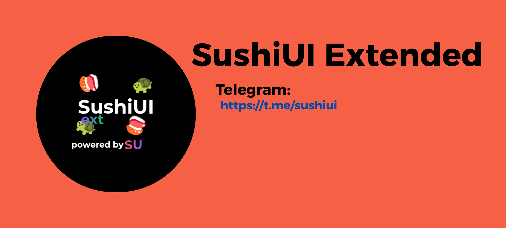

# SushiUI Extended
SushiUI Extended is the newest successor to SushiUI, a Magisk module that adds apps, changes sounds, and much more!

Our socials 
[Telegram](https://t.me/sushiui)
[Discord](https://discord.gg/zKGPr6YKVK)
[Sourceforge](https://sourceforge.net/projects/sushiui/)
## ***sushi_device_vendor_codename*** Repos: what is this?
SushiUI typically only supports specific devices, such as bangkk, rhode, fogo, fogos, or cancun, but we are working on a generic version. 
